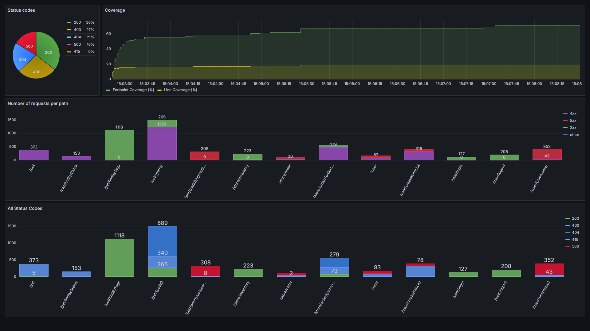

# WuppieFuzz

TNO developed WuppieFuzz, a coverage-guided REST API fuzzer developed on top of
LibAFL, targeting a wide audience of end-users, with a strong focus on
ease-of-use, explainability of the discovered flaws and modularity. WuppieFuzz
supports all three settings of testing (black box, grey box and white box).

## WuppieFuzz-dashboard

A long fuzzing campaign can generate large amounts of data. One of the main
challenges of fuzzing is how to make sense of this data and to use it
effectively. To improve this process, WuppieFuzz makes use of Grafana to
visualise the fuzzing data in a user-friendly dashboard.



Below we will describe the steps for using this dashboard.

### Requirements

Docker is required to use the Grafana dashboard.

### Database

It is assumed that the `report.db` output of your fuzzing campaign is stored in
`../reports/grafana/report.db` relative to this directory. If your database is
stored elsewhere, you can modify this path in the `compose.yml`.

### Starting Grafana

Run the following command:

```sh
docker compose up -d
```

This will create a Docker container which will host the Grafana dashboard on
port 3000. In case another service is already running on port 3000, go to the
file `compose.yaml` and change the lines

```docker
ports:
  - "3000:3000"
```

to

```docker
ports:
  - "<YOUR PORT>:3000"
```

To view the dashboard, open a web browser and visit the URL
`http://localhost:3000`, or replace 3000 by the alternative port you chose.
